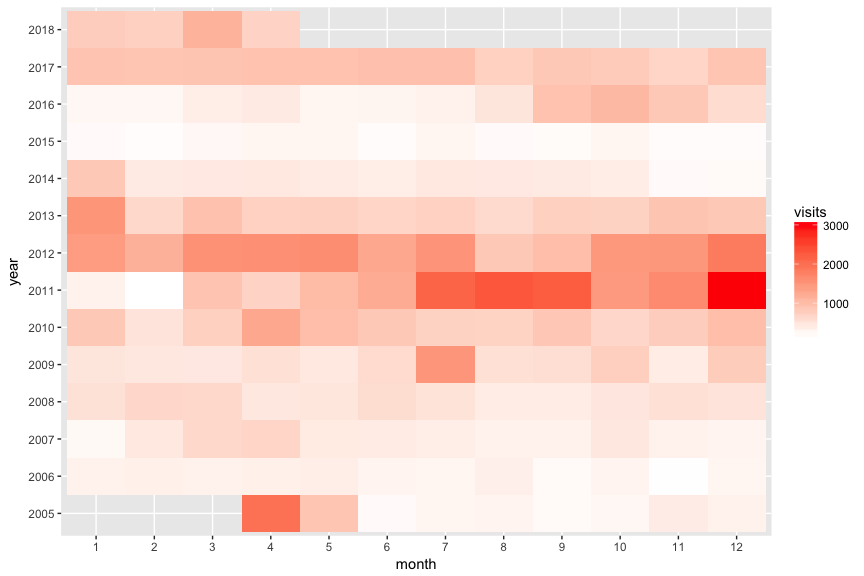
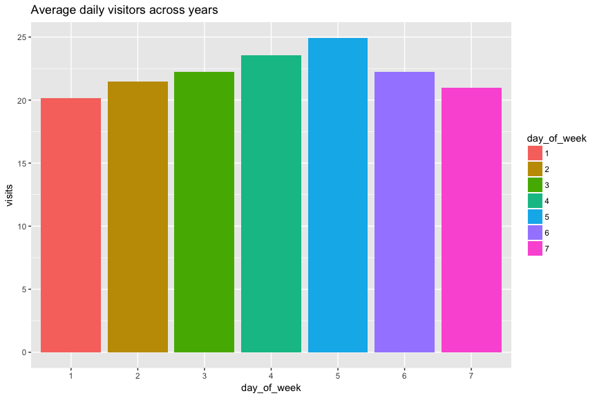
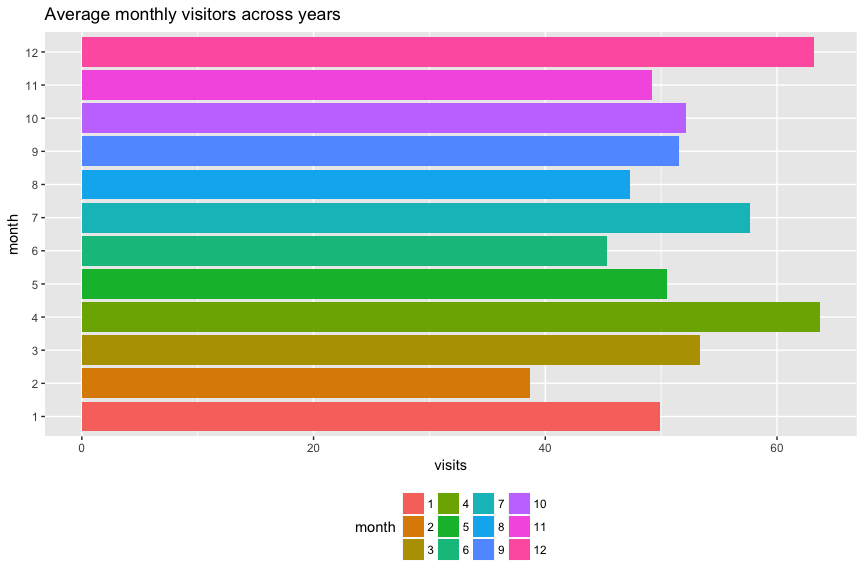
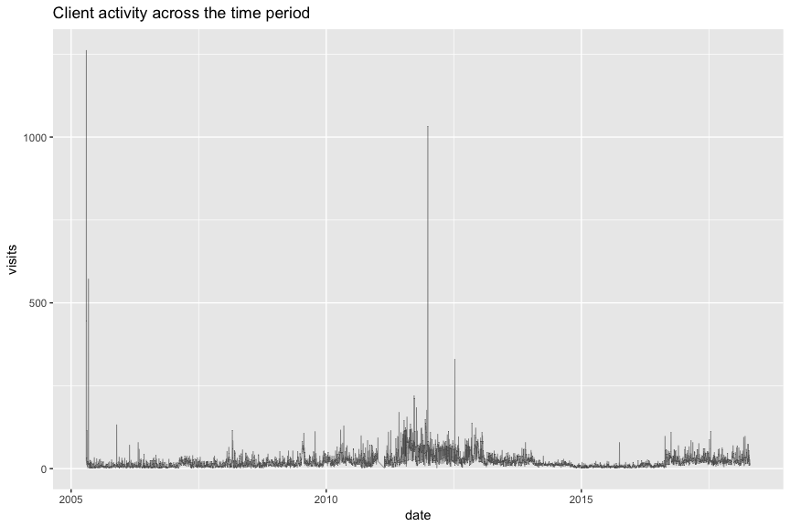
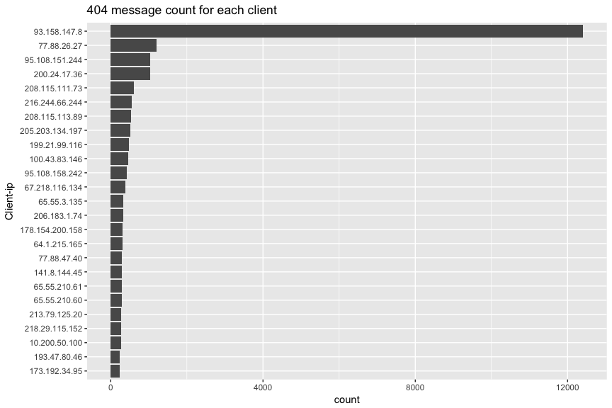
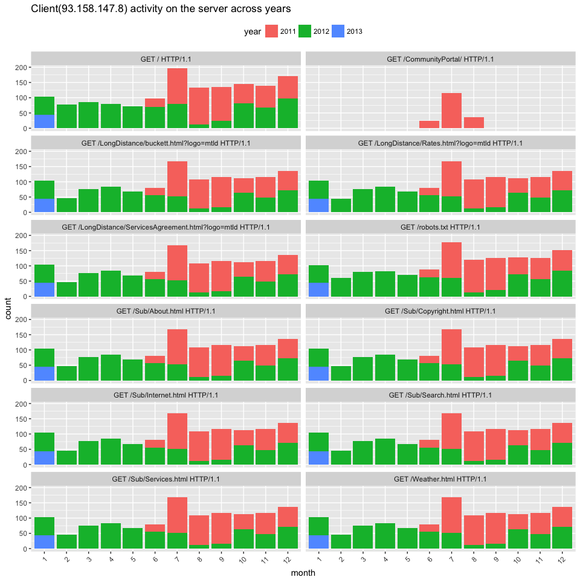

Detecting web-crawlers by analysing access-logs using R
================
Suhas Hegde
4/24/2018

Web-crawlers are used by almost all known search engines to index URLs on the web. We can normally detect web-crawler activity on a web-server based on the access log. Web-crawlers have one important difference compared to normal human users, they can send requests for multiple resources at once which is not the case during normal usage. We can detect this by exploratory analysis of access logs.

The access-log chosen has data for around 10 years worth of server access in this instance. First few steps involve parsing and cleaning the data.

``` r
# load up required libraries
library(tidyverse)
library(lubridate)

# read and parse the access log
log_file <- read_log("access.log")

# drop the first two columns that are filled with NA's
log_file %>%
  select(-c(X2,X3)) -> log_file

# set meaningful column names
colnames(log_file) <- c("client_ip","timestamp","request_type",
                        "status_code","size_of_reply","referer_URL","user_agent")

# convert timestamp to a proper date format
log_file$timestamp <- dmy_hms(log_file$timestamp)

# print the first few rows of data
log_file%>% head(5)
```

    ## # A tibble: 5 x 7
    ##   client_ip  timestamp           request_type    status_code size_of_reply
    ##   <chr>      <dttm>              <chr>                 <int>         <int>
    ## 1 207.46.98… 2005-04-19 20:05:03 GET /robots.tx…         404           208
    ## 2 207.46.98… 2005-04-19 20:05:03 GET /Rates.htm…         200         12883
    ## 3 10.200.50… 2005-04-19 20:08:30 GET /Clipart/B…         200          3372
    ## 4 10.200.50… 2005-04-19 20:08:30 GET /Clipart/g…         200          1575
    ## 5 10.200.50… 2005-04-19 20:08:30 GET /Buttons/H…         200          2749
    ## # ... with 2 more variables: referer_URL <chr>, user_agent <chr>

First order of business is to look at top visitors to the server.

``` r
# group by client ip address and count the number of visits 
log_file %>%
  select(client_ip) %>%
  group_by(client_ip) %>%
  summarise(count = n()) %>%
  arrange(desc(count))
```

    ## # A tibble: 10,426 x 2
    ##    client_ip       count
    ##    <chr>           <int>
    ##  1 93.158.147.8    13849
    ##  2 77.88.26.27      1444
    ##  3 10.200.50.100    1284
    ##  4 95.108.151.244   1184
    ##  5 200.24.17.36     1028
    ##  6 199.21.99.116     943
    ##  7 216.244.66.244    833
    ##  8 205.203.134.197   830
    ##  9 208.115.111.73    805
    ## 10 100.43.83.146     691
    ## # ... with 10,416 more rows

It looks like one ip-address had more visits than any other ip-address. That points towards that client being a crawler(bot). But let us break down the data by monthly, weekly and other time series measures first and then move forward.

``` r
# plot count by yearly, daily, weekly, monthly
log_file %>%
  group_by(month =  as.factor(month(timestamp)), year =  as.factor(year(timestamp))) %>%
  summarise(visits = n()) %>%
  ggplot(., aes(month, year))+
  geom_tile(aes(fill = visits)) +
  scale_fill_gradient(low = "white", high = "red")
```



``` r
log_file %>%
  group_by(day_of_week = as.factor(wday(timestamp))) %>%
  summarise(visits = n()) %>%
  mutate(visits = visits/(13*52)) %>%
  ggplot(., aes(day_of_week,visits))+
  geom_bar(aes(fill = day_of_week), stat = "identity") +
  ggtitle("Average daily visitors across years")
```



``` r
log_file %>%
  group_by(month = as.factor(month(timestamp))) %>%
  summarise(visits = n()/13*12) %>%
  mutate(visits = visits/(13*12)) %>%
  ggplot(., aes(month,visits))+
  geom_bar(aes(fill = month), stat = "identity") +
  coord_flip() +
  theme(legend.position = "bottom") +
  ggtitle("Average monthly visitors across years")
```



After looking at the plots above it is evident that the average number of visits per day ranges from 20 to 25.

``` r
# no of visits across years as a time series
log_file %>%
  group_by(date =date(timestamp)) %>%
  summarise(visits = n()) %>%
  ggplot(., aes(date,visits))+
  geom_line(size = .2,alpha = .65) +
  ggtitle("Client activity across the time period")
```



The above plot confirms that number of visits per day does not exceed 30 on most days. We can also look at some instances where it has spiked substantially. Also there seems to be one instance where the server was down for a considerable amount of time.

The next indicator to look at are the status codes sent back to the client. Normally we should have more cases of 200-"OK" than others such as 404-"error". If that is not case then it indicates that the clients are either trying to access resources on the server that do not exist or not accessible by default. It can either point towards some form of web-crawling or a malicious attack.

``` r
log_file %>%
  group_by(status_code) %>%
  summarise(count = n()) %>%
  mutate(proportion_in_percentage = (count/sum(count))*100) %>%
  arrange(desc(count)) 
```

    ## # A tibble: 9 x 3
    ##   status_code count proportion_in_percentage
    ##         <int> <int>                    <dbl>
    ## 1         404 65197                62.0     
    ## 2         200 36609                34.8     
    ## 3         400  2311                 2.20    
    ## 4         304  1005                 0.956   
    ## 5         206    39                 0.0371  
    ## 6         301    10                 0.00951 
    ## 7         405     3                 0.00285 
    ## 8         403     2                 0.00190 
    ## 9         413     1                 0.000951

We can definitely say something is amiss with our server. More than 60% of our clients are being replied with a 404 error message. Let us try to decipher which clients are receiving the most amount of these errors.

``` r
log_file %>%
  filter(status_code == 404) %>%
  group_by(client_ip) %>%
  summarise(count =n()) %>%
  arrange(desc(count)) %>%
  head(n=25) %>%
  ggplot(., aes(client_ip,count))+
  geom_bar(stat = "identity") +
  aes(x=reorder(client_ip,count))+
  coord_flip() +
  xlab("Client-ip")+
  ggtitle("404 message count for each client")
```



One particular ip (93.158.147.8) accounts for almost 20% of the total errors received. So let us look at it closely. Also it helps if we look closely at what kind of resources these clients are requesting from the server.

``` r
log_file %>%
  filter(status_code == 404) %>%
  group_by(client_ip) %>%
  summarise(count =n()) %>%
  arrange(desc(count)) %>%
  left_join(., log_file) %>%
  group_by(request_type) %>%
  summarise(count = n()) %>%
  arrange(desc(count))
```

    ## # A tibble: 2,864 x 2
    ##    request_type                                    count
    ##    <chr>                                           <int>
    ##  1 GET /robots.txt HTTP/1.1                        18197
    ##  2 GET / HTTP/1.1                                  17115
    ##  3 GET /robots.txt HTTP/1.0                         5434
    ##  4 GET /Weather.html HTTP/1.1                       2403
    ##  5 GET /Sub/About.html HTTP/1.1                     2398
    ##  6 GET /Sub/Internet.html HTTP/1.1                  2398
    ##  7 GET /Sub/Search.html HTTP/1.1                    2380
    ##  8 GET /Sub/Services.html HTTP/1.1                  2347
    ##  9 GET /Sub/Copyright.html HTTP/1.1                 2330
    ## 10 GET /LongDistance/Rates.html?logo=mtld HTTP/1.1  2210
    ## # ... with 2,854 more rows

Close to 24000 requests are being made to the "robots.txt" file indicating bot activity. Since that particular file should have details regarding what are the resources that are available to the bots. Most "polite" bots should look for that file first before start requesting other resources. This particular summary confirms crawler activity on the server.

``` r
log_file %>%
  filter(client_ip == "93.158.147.8") %>%
  group_by(year = as.factor(year(timestamp)) ,month = as.factor(month(timestamp)),
           request_type, status_code =  as.factor(status_code)) %>%
  summarise(count = n()) %>%
  ggplot(., aes(month,count))+
  geom_bar(aes(fill = year),stat = "identity")+
  facet_wrap(~request_type, ncol = 2) +
  theme(legend.position = "top",
        axis.text.x = element_text(angle = 45, hjust = 1)) +
  ggtitle("Client(93.158.147.8) activity on the server across years")
```



The plot above looks at the distribution of requests made to various resources over the years by the client (ip-address-93.158.147.8) which we are interested in. It made roughly similar amount of requests to all resources across the time period. Now we can say with a certain amount of assurances that this particular client is an actual bot that is indexing our server. We can confirm this by looking at the "user agent" associated with the client. We will also look at the number of types of user agents associated with this particular client.

``` r
# look at the user agents associated with client-ip 93.158.147.8
log_file %>%
  filter(client_ip == "93.158.147.8") %>%
  select(user_agent) %>%
  head(.)
```

    ## # A tibble: 6 x 1
    ##   user_agent                                                              
    ##   <chr>                                                                   
    ## 1 Mozilla/5.0 (compatible; YandexBot/3.0; MirrorDetector; +http://yandex.…
    ## 2 Mozilla/5.0 (compatible; YandexBot/3.0; MirrorDetector; +http://yandex.…
    ## 3 Mozilla/5.0 (compatible; YandexBot/3.0; MirrorDetector; +http://yandex.…
    ## 4 Mozilla/5.0 (compatible; YandexBot/3.0; MirrorDetector; +http://yandex.…
    ## 5 Mozilla/5.0 (compatible; YandexBot/3.0; MirrorDetector; +http://yandex.…
    ## 6 Mozilla/5.0 (compatible; YandexBot/3.0; MirrorDetector; +http://yandex.…

``` r
log_file %>%
  filter(client_ip == "93.158.147.8") %>%
  group_by(user_agent) %>%
  summarise(count = n())
```

    ## # A tibble: 2 x 2
    ##   user_agent                                                         count
    ##   <chr>                                                              <int>
    ## 1 Mozilla/5.0 (compatible; YandexBot/3.0; +http://yandex.com/bots)   13459
    ## 2 Mozilla/5.0 (compatible; YandexBot/3.0; MirrorDetector; +http://y…   390

There are two unique user agents that are associated with this client. The name of the name of the crawler is ["YandexBot"](http://www.botopedia.org/user-agent-list/search-bots/yandex-bot). After quick Google search it was confirmed that indeed this an actual bot used by the Yandex search engine. Finally we can use some regexp magic and filter out suspected web-crawlers. We are going to use a very naive approach here by searching for terms that have a "bot" at the end of the string.

``` r
log_file %>%
  filter(str_detect(log_file$user_agent,"[A-z]{1,}Bot|[A-z]{1,}bot")) %>%
  pull(user_agent) %>%
  str_extract(.,"[A-z]{1,}Bot|[A-z]{1,}bot") %>%
  data_frame(botname =.) %>%
  group_by(botname) %>%
  summarise(count = n()) %>%
  arrange(desc(count)) %>%
  head(n=10)
```

    ## # A tibble: 10 x 2
    ##    botname   count
    ##    <chr>     <int>
    ##  1 YandexBot 20416
    ##  2 bingbot    9543
    ##  3 msnbot     7253
    ##  4 Googlebot  6666
    ##  5 DotBot     1640
    ##  6 robot      1535
    ##  7 SurveyBot  1129
    ##  8 AhrefsBot   935
    ##  9 Searchbot   804
    ## 10 VoilaBot    678

Even though we have used very naive approach here, since the log-file is fairly large and we are only selecting the top 10 clients filtered by number of hits we are still able to detect bots with a certain degree of accuracy. In fact out of the top 10 only one of them is not a known web-crawler(accuracy of 90%). This is due to the fact that web-crawlers will visit any given server more number of times compared to other normal users. This can help in search related optimization. We have detected web-crawlers(bots) with high degree of accuracy by using exploratory data analysis.
